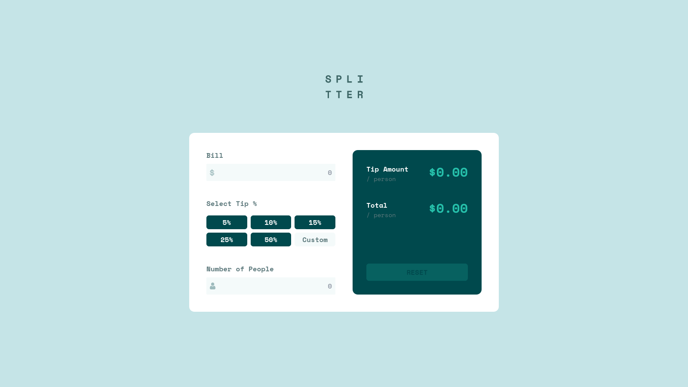

# Frontend Mentor - Tip calculator app solution

This is a solution to the [Tip calculator app challenge on Frontend Mentor](https://www.frontendmentor.io/challenges/tip-calculator-app-ugJNGbJUX). Frontend Mentor challenges help you improve your coding skills by building realistic projects.

## Table of contents

- [Frontend Mentor - Tip calculator app solution](#frontend-mentor---tip-calculator-app-solution)
  - [Table of contents](#table-of-contents)
  - [Overview](#overview)
    - [The challenge](#the-challenge)
    - [Screenshot](#screenshot)
    - [Links](#links)
  - [My process](#my-process)
    - [Built with](#built-with)
  - [Author](#author)
  - [Acknowledgments](#acknowledgments)

**Note: Delete this note and update the table of contents based on what sections you keep.**

## Overview

### The challenge

Users should be able to:

- View the optimal layout for the app depending on their device's screen size
- See hover states for all interactive elements on the page
- Calculate the correct tip and total cost of the bill per person

### Screenshot

### Links

- Solution URL: [Solution URL](https://github.com/AbdoArafh/tip-calculator)
- Live Site URL: [live site](https://abdoarafh.github.io/tip-calculator/)

## My process

### Built with

- [TailwindCSS](https://tailwindcss.com/)
- Flexbox
- CSS Grid
- Desktop-first workflow
- [Preact](https://preactjs.com)
- [Vitejs](https://vitejs.dev/)

## Author

- Frontend Mentor - [@AbdoArafh](https://www.frontendmentor.io/profile/AbdoArafh)
- Twitter - [@abdoarafh](https://www.twitter.com/abdoarafh)

## Acknowledgments

Thank you [Frontend Mentor](https://www.frontendmentor.io) for the great designs and ideas